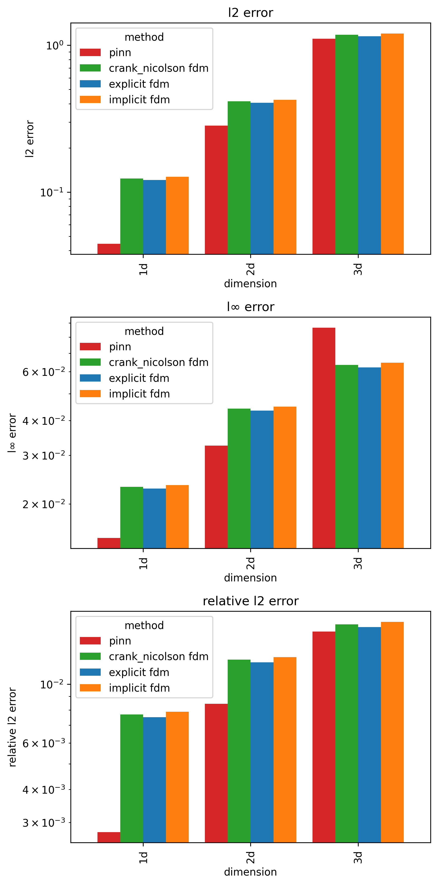

# Evaluation of PINNs for Solving PDEs

## Project Description

This project presents a comparative evaluation of Physics-Informed Neural Networks (PINNs) and classical Finite Difference Methods (Explicit, Implicit, and Crank–Nicolson) for solving 1D, 2D, and 3D heat equations under coarse discretization, benchmarking accuracy, stability, and computational efficiency. The study analyzes analytical solutions, implements full numerical solvers, builds dimensional PINN architectures with adaptive loss balancing, and provides a systematic performance comparison across dimensions to highlight the practical strengths and limitations of both approaches.

This work was carried out as my **Final Year Project (MATH 499) and submitted in partial fulfillment of the requirements of the THE BACHELOR OF SCIENCE IN COMPUTATIONAL MATHEMATICS**.

**Key Specifications:**
- **Domain:** Unit domain [0,1]ⁿ, spatial grid 15³ (dx=0.0714 m), temporal range t∈[0,60]s (100 steps)
- **Methods:** Analytical (N=50 Fourier terms), Explicit/Implicit/Crank-Nicolson FDM, PINN
- **PINN Search:** 864 hyperparameter configurations across 1D/2D/3D
- **Best PINN Accuracy:** 99.72% (1D), 99.16% (2D), 98.42% (3D)
- **Framework:** PyTorch with deterministic CUDA (Tesla P100-PCIE-16GB)

The complete report is available as [Report.pdf](Report.pdf) \
The code is available as [eopfsp.ipynb](eopfsp.ipynb)

---

## Table of Contents

- [Project Description](#project-description)
- [Features](#features)
- [Problem Formulation](#problem-formulation)
- [Methodology](#methodology)
- [Model Architecture (PINN)](#model-architecture-pinn)
- [Training Configuration](#training-configuration)
- [Results & Analysis](#results--analysis)
- [Mathematical Foundations](#mathematical-foundations)
- [Known Issues & Limitations](#known-issues--limitations)
- [Dependencies](#dependencies)
- [Primary References](#primary-references)
- [License](#license)

## Features

- **Three Solution Methods:** Analytical (ground truth), FDM (3 schemes), PINN
- **Multi-Dimensional:** Unified pipeline for 1D, 2D, and 3D problems
- **PINN Hyperparameter Search:** 864 configurations across depth, width, activation, optimizer, LR, and initialization
- **Reproducible:** Fixed seed (42), deterministic CUDA
- **Visualization:** Training curves, error comparisons, collocation point plots

## Problem Formulation

### Governing Equation

$$\frac{\partial u}{\partial t} = \alpha \nabla^2 u, \quad \alpha = 1.1644 \times 10^{-4} \text{ m}^2/\text{s (copper)}$$

### Initial & Boundary Conditions

- **IC (triangular wave):** u(x,0) = 2x/L for x≤L/2, 2(L−x)/L for x>L/2; extended as products for 2D/3D
- **BC:** Homogeneous Dirichlet — u=0 at all boundaries

### Computational Domain

| Dimension | Space-Time Points | Spatial Grid | Time Steps |
|-----------|-------------------|--------------|------------|
| 1D | 1,500 | 15 nodes | 100 |
| 2D | 22,500 | 15×15 nodes | 100 |
| 3D | 337,500 | 15×15×15 nodes | 100 |

## Methodology

### Analytical Solution (Ground Truth)

Fourier series with N=50 terms.

### Finite Difference Methods

| Scheme | Formulation | Stability r (1D/2D/3D) |
|--------|-------------|------------------------|
| Explicit | Forward Euler | 0.0137 / 0.0274 / 0.0411 |
| Implicit | Backward Euler + sparse inversion | 0.0137 / 0.0274 / 0.0411 |
| Crank-Nicolson | θ-method, θ=0.5 | 0.0137 / 0.0274 / 0.0411 |

All stability parameters r = α·(dt/dx²) are well below the critical threshold of 0.5.

### Physics-Informed Neural Networks

Fully connected feedforward networks trained on weighted PDE + BC + IC loss. Collocation points sampled via Latin Hypercube Sampling (LHS), resampled every 100 epochs.

**Collocation Point Budget:**

| Dimension | PDE | BC | IC | Total |
|-----------|-----|----|----|-------|
| 1D | 3,000 | 1,000 | 2,000 | 6,000 |
| 2D | 30,000 | 10,000 | 20,000 | 60,000 |
| 3D | 60,000 | 20,000 | 40,000 | 120,000 |

## Model Architecture (PINN)

**Best Configurations per Dimension:**

| Dim | Depth | Width | Activation | LR | Optimizer | Loss Weighting | Init | Time (s) | Memory (MB) |
|-----|-------|-------|------------|-----|-----------|----------------|------|----------|-------------|
| 1D | 2 | 8 | tanh | 5×10⁻³ | Adam | adaptive_gradnorm | Kaiming | 59.1 | 67 |
| 2D | 6 | 64 | tanh | 5×10⁻⁴ | Adam | adaptive_gradnorm | Xavier | 202.2 | 919 |
| 3D | 6 | 128 | tanh | 5×10⁻⁴ | Adam | adaptive_gradnorm | Xavier | 893.9 | 4,503 |

**Key findings:** tanh consistently outperforms GELU/SiLU/Mish; Adam-only achieves best results; Adam→LBFGS switching provides no benefit; deeper/wider networks required for higher dimensions.

## Training Configuration

### Hyperparameters

| Parameter | Value |
|-----------|-------|
| **Training Epochs** | 6,000 |
| **LR Options** | 5×10⁻³, 5×10⁻⁴ |
| **Optimizer** | Adam / Adam→LBFGS |
| **LR Decay** | Exponential (γ=0.99) |
| **Gradient Clipping** | Dimension dependent |
| **L2 Regularization** | 10⁻⁴ (LBFGS only) |
| **Early Stopping** | loss > 16 after epoch 400 |
| **Collocation Resampling** | Every 100 epochs (LHS) |
| **Total Configurations Searched** | 864 |

### Loss Function

$$\mathcal{L} = w_{\text{PDE}}\mathcal{L}_{\text{PDE}} + w_{\text{BC}}\mathcal{L}_{\text{BC}} + w_{\text{IC}}\mathcal{L}_{\text{IC}}$$

Three weighting strategies tested: equal, adaptive_gradnorm, adaptive_lr_annealing.

**Final Training Losses (Best Configurations):**

| Dim | PDE Loss | BC Loss | IC Loss | Total Loss |
|-----|----------|---------|---------|------------|
| 1D | 2.17×10⁻⁸ | 7.78×10⁻⁷ | 3.11×10⁻⁵ | 3.31×10⁻⁵ |
| 2D | 3.34×10⁻⁸ | 7.07×10⁻⁶ | 2.73×10⁻⁵ | 4.79×10⁻⁵ |
| 3D | 1.81×10⁻⁸ | 1.40×10⁻⁵ | 4.30×10⁻⁵ | 3.94×10⁻⁵ |

## Results & Analysis

| Dim | Method | Rel L2 (%) | L∞ Error | Accuracy (%) | Time (s) | Speedup vs Explicit |
|-----|--------|------------|----------|--------------|----------|---------------------|
| **1D** | Explicit FDM | 0.751 | 0.0228 | 99.25 | 0.003 | 1× |
| | Implicit FDM | 0.788 | 0.0234 | 99.21 | 0.015 | 0.2× |
| | CN FDM | 0.770 | 0.0231 | 99.23 | 0.010 | 0.3× |
| | **PINN** | **0.276** | **0.0151** | **99.72** | 59.1 | 0.00005× |
| **2D** | Explicit FDM | 1.212 | 0.0435 | 98.79 | 0.005 | 1× |
| | Implicit FDM | 1.268 | 0.0449 | 98.73 | 0.040 | 0.13× |
| | CN FDM | 1.240 | 0.0442 | 98.76 | 0.041 | 0.12× |
| | **PINN** | **0.845** | **0.0325** | **99.16** | 202.2 | 0.000025× |
| **3D** | Explicit FDM | 1.646 | 0.0622 | 98.35 | 0.011 | 1× |
| | Implicit FDM | 1.723 | 0.0646 | 98.28 | 2.50 | 0.004× |
| | CN FDM | 1.685 | 0.0635 | 98.32 | 2.59 | 0.004× |
| | **PINN** | **1.583** | **0.0866** | **98.42** | 893.9 | 0.000012× |

**PINN achieves 2.7× (1D), 1.4× (2D), 1.0× (3D) lower relative error than best FDM at 19,200–81,300× higher computational cost.**

| Errors Result |
|:--:|
|  |

### Discretization Efficiency

| Dimension | FDM Space-Time Nodes | PINN Collocation Points | Efficiency Ratio (FDM/PINN) |
|-----------|----------------------|-------------------------|-----------------------------|
| 1D | 1,500 | 6,000 | 0.25× |
| 2D | 22,500 | 60,000 | 0.38× |
| 3D | 337,500 | 120,000 | **2.81×** |

PINN uses 4× more points in 1D/2D but becomes **2.8× more point-efficient in 3D** while simultaneously achieving superior accuracy — a crossover effect driven by the curse of dimensionality.

## Mathematical Foundations

### Analytical Solution

$$u(x,t) = \sum_{n=1}^{N} b_n \sin\!\left(\frac{n\pi x}{L}\right) e^{-\alpha(n\pi/L)^2 t}, \quad b_n = \frac{8}{n^2\pi^2}\sin\!\left(\frac{n\pi}{2}\right)$$

Convergence: O(1/N) with max error 0.0081 at t=0 for N=50.

### PINN Loss

$$\mathcal{L}_{\text{PDE}} = \frac{1}{N_f}\sum_{i=1}^{N_f}\!\left|\frac{\partial \hat{u}}{\partial t} - \alpha\nabla^2\hat{u}\right|^2, \quad \mathcal{L}_{\text{BC}} = \frac{1}{N_b}\sum_{i=1}^{N_b}|\hat{u}(\mathbf{x}_b^i, t^i)|^2, \quad \mathcal{L}_{\text{IC}} = \frac{1}{N_0}\sum_{i=1}^{N_0}|\hat{u}(\mathbf{x}^i, 0) - u_0(\mathbf{x}^i)|^2$$

### FDM Stability

Explicit scheme stability: r = α·(dt/dx²) < 0.5. Actual values (r = 0.0137 / 0.0274 / 0.0411 for 1D/2D/3D respecitively) are all safely below the critical threshold.

## Known Issues & Limitations

**1. PINN Computational Cost**
PINN requires 19,200–81,300× more computation than explicit FDM on clean data. For clean, low-dimensional, real-time applications, explicit FDM is strictly optimal.

**2. Hyperparameter Sensitivity**
864 configurations were needed to identify optimal PINN settings.

**3. Memory Scaling**
PINN memory: 67 MB (1D) → 919 MB (2D) → 4,503 MB (3D). A high-VRAM GPU (≥16GB) is required for 3D experiments.

**4. Unit Hypercube Domain Only**
Current implementation assumes [0,1]ⁿ domains. Irregular geometries require mesh-based or adaptive collocation strategies.

**5. Analytical Solver Scaling**
3D analytical computation is 860× slower than 2D due to triple-product Fourier summation — practical only as an offline ground truth.

## Dependencies

```
torch>=2.0.0
numpy>=1.26.0
matplotlib>=3.7.0
pandas>=2.0.0
scipy>=1.11.0
scikit-learn>=1.3.0
```

**Hardware:** NVIDIA GPU with ≥16GB VRAM recommended for 3D PINN experiments.

## Primary References

M. Raissi, P. Perdikaris, and G. E. Karniadakis, *Physics Informed Deep Learning (Part I): Data-driven Solutions of Nonlinear Partial Differential Equations*, arXiv:1711.10561, 2017. https://arxiv.org/abs/1711.10561

## License

This project is licensed under the MIT License. See [LICENSE](LICENSE) for details.
